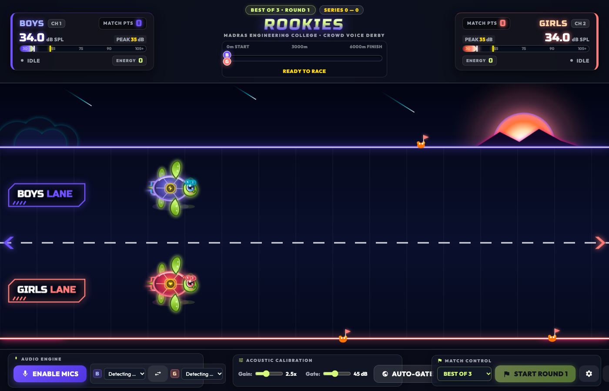
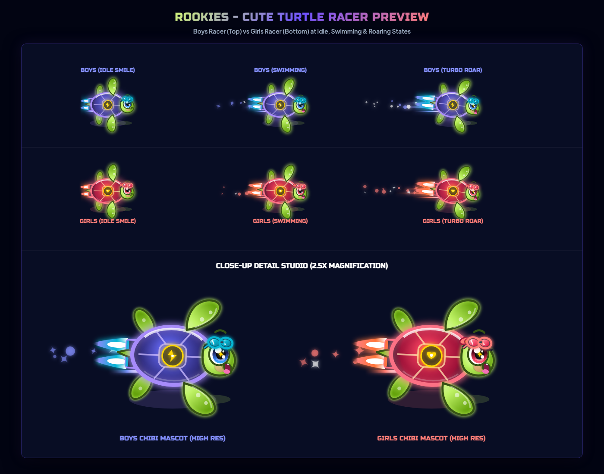

# ROOKIES: Collegiate Crowd Voice Derby

An energetic, broadcast-grade acoustic browser game built for high-energy crowd competitions, auditoriums, and collegiate icebreakers.

Two teams (**Boys** and **Girls**) compete by shouting into microphones. The louder their cheering decibels, the faster their custom-animated chibi turtle racers propel forward across a synthwave neon track with hydrodynamic flippers, twin plasma thrusters, and nitro rocket plumes.

Designed with **Madras Engineering College** (`madrascollege.ac.in`) brand aesthetics.



---

## Highlights & Features

- **Procedural Chibi Turtle Racers**:
  - Expressive kawaii anime eyes with multi-specular catchlight sparkles, blushing cheeks, and dynamic blinking.
  - Mouths open dynamically into joyful cheers with pink tongues synchronized to vocal decibel levels.
  - Sporty forehead aviator goggles (Boys: cyan lenses & lightning emblem; Girls: rose-gold goggles with ribbon bow & heart emblem).
  - Hydrodynamic paddle flippers with natural swimming flutters and twin micro-boosters blasting rocket plasma plumes and star particles.
  - Zero external raster images or emojis — 100% vector SVG and HTML5 Canvas.



- **Broadcast-Grade Esports HUD**:
  - Precision dual VU decibel meters (30 to 105+ dB SPL) with peak hold indicators and dynamic energy scoring.
  - Real-time telemetry track bar with moving team pins and dynamic lead distance tracking.
  - High-visibility lane badges, glowing chevrons, and checkered finish line gate.

- **Tournament Match Engine**:
  - **Best-of-3 / Best-of-5 Series**: Real-time series standings, clean sweep detection (e.g. 2-0 ends series immediately), match point alerts, and winner-take-all decider rounds (1-1 tie unlocks Round 3 Decider).
  - Comprehensive series recap table with peak decibel logs, race durations, and final standings.

- **Acoustic Engineering & Hardware Support**:
  - **Dual USB Microphones**: Assign independent USB microphones directly to Boys and Girls.
  - **Stereo Splitter Mode**: Route Left channel to Boys and Right channel to Girls from a single stereo interface.
  - **1-Click Mic Swap**: Swap audio routing instantly without interrupting setup.
  - **1-Click Room Noise Auto-Gate**: 1.5-second ambient noise calibration to automatically ignore room chatter.
  - **Keyboard Simulator Mode**: For testing without microphones (`A` for Boys, `L` for Girls).

---

## Quick Start

You can open `index.html` directly in any modern browser, or launch with a lightweight local web server:

```bash
# Using Python:
python3 -m http.server 8000

# Using Node npx:
npx -y serve .
```

Then visit `http://localhost:8000` in Google Chrome or any Chromium browser.

### How to Run a Match

1. Click **ENABLE MICS** in the bottom command deck.
2. Grant microphone permissions when prompted.
3. Select your Left and Right microphones or use **AUTO-GATE (1.5s)** to calibrate ambient room noise.
4. Select your series format (**Best of 3**, **Best of 5**, or **Single Race**).
5. Click **START ROUND 1** and let the crowd shout to race!

---

## License

MIT License. Designed and developed for college events and community competitions.
